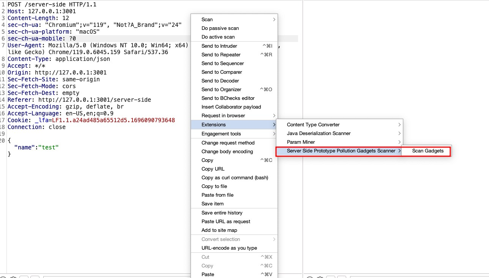
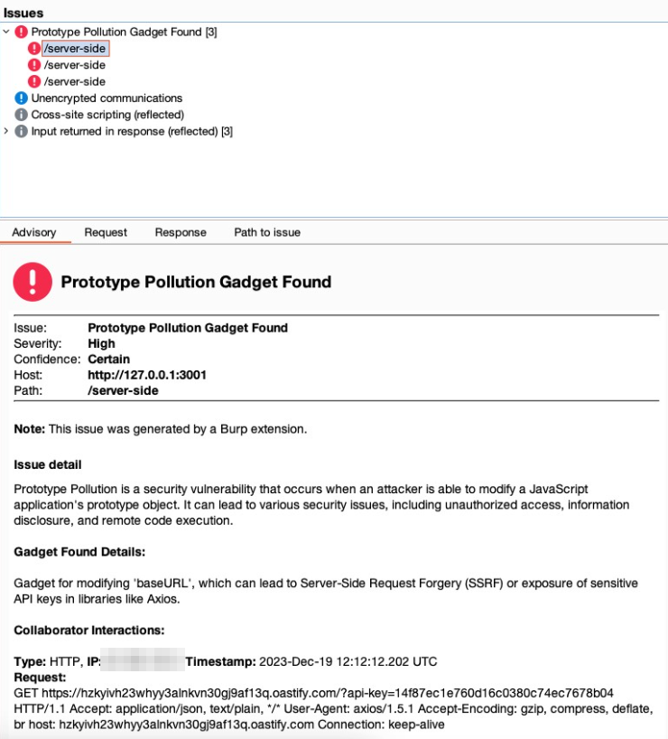

# Server Side Prototype Pollution Gadgets Scanner

## Description
The Server Side Prototype Pollution Gadgets Scanner is a powerful Burp Suite extension designed to detect and analyze server-side prototype pollution vulnerabilities in web applications. This tool automates the process of scanning requests to identify potential prototype pollution issues. It exploits known gadgets - methods of leveraging prototype pollution to execute harmful actions - particularly focusing on Node.js libraries.

## Features
- Automated scanning of HTTP requests for prototype pollution vulnerabilities.
- Detection and exploitation of known gadgets in Node.js libraries.
- Direct exploitation approach to assess the impact of prototype pollution in server-side environments.

## How to Use
1. Load the extension in Burp Suite.
2. Right-click on any HTTP request and select "Extensions -> Server Side Prototype Pollution Gadgets Scanner -> Scan Gadgets"
3. The extension will analyze the request and attempt to poison the prototype if the application is vulnerable.
4. Review the results to identify potential gadgets and their impacts.

## Contributions
We welcome contributions to the Server Side Prototype Pollution Gadgets Scanner! If you have a new gadget to add, please submit a pull request with the following format:

```json
{
    "payload": {"cc": "email@<URL>"},
    "description": "Gadget for adding a CC address in email libraries, which could be exploited to intercept all emails sent by the platform.",
    "null_payload": {"cc": null}
}
```

Please ensure your pull request includes:
- A detailed description of the gadget and its potential impact.
- A valid proof of concept demonstrating the gadget in action.

## Screenshots



## Disclaimer
This tool is intended for educational and ethical testing purposes only. The authors are not responsible for any misuse or damage caused by this tool.
